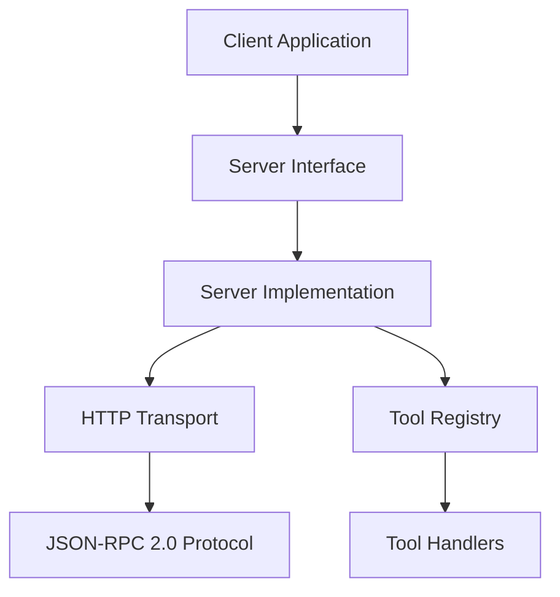

# System Patterns

## Architecture Overview

GoC-MCP follows a layered architecture with clear separation of concerns:



## Key Components

### 1. Server Interface
The `Server` interface in the `mcpApi` package defines the contract for MCP server implementations:
- `Start()`: Initializes and begins server operations
- `Stop()`: Gracefully terminates server operations

This interface allows for different implementations while maintaining a consistent API.

### 2. Server Implementation
The concrete `serverImpl` type implements the `Server` interface and:
- Manages the lifecycle of the MCP server
- Configures the transport layer
- Handles server startup and shutdown

### 3. Tool Registration
Tools are registered using a generic function that:
- Takes a strongly typed input parameter
- Returns a tool response or error
- Automatically generates JSON Schema for input validation

```go
RegisterTool[T any](
    server mcpApi.Server, 
    name string, 
    description string, 
    handler func(input T) (*mcpGo.ToolResponse, error)
) error
```

### 4. Transport Layer
The HTTP transport layer:
- Exposes the MCP server over HTTP
- Handles JSON-RPC 2.0 requests and responses
- Manages connection lifecycle

### 5. Dependency Injection
The project uses Uber's fx for dependency injection, which:
- Simplifies component wiring
- Manages lifecycle hooks
- Provides a clean way to configure and extend the system

## Design Patterns

### 1. Interface-based Design
The system uses interfaces to define contracts between components, allowing for:
- Mock implementations for testing
- Alternative implementations for different use cases
- Clear separation of concerns

### 2. Generics for Type Safety
Go generics are used to provide type safety for tool registration:
- Input types are validated at compile time
- JSON Schema is automatically generated from Go struct tags
- Reduces runtime errors due to type mismatches

### 3. Builder Pattern
The transport configuration uses a builder pattern:
```go
transport := http.NewHTTPTransport("/mcp")
transport.WithAddr(fmt.Sprintf(":%d", s.config.Port))
```

### 4. Dependency Inversion
The system follows the dependency inversion principle:
- High-level modules depend on abstractions
- Low-level modules implement those abstractions
- This allows for easier testing and component replacement

## Communication Flow

1. Client sends a JSON-RPC 2.0 request to the HTTP endpoint
2. Server deserializes the request
3. Server routes the request to the appropriate tool handler
4. Tool handler processes the request and generates a response
5. Server serializes the response and sends it back to the client

## Error Handling

The system uses a consistent error handling approach:
- JSON-RPC 2.0 error responses for protocol-level errors
- Go error types for internal error handling
- Proper error propagation through the layers

## Extension Points

The architecture provides several extension points:
- Custom tool implementations
- Alternative transport layers
- Custom error handling
- Integration with different dependency injection frameworks